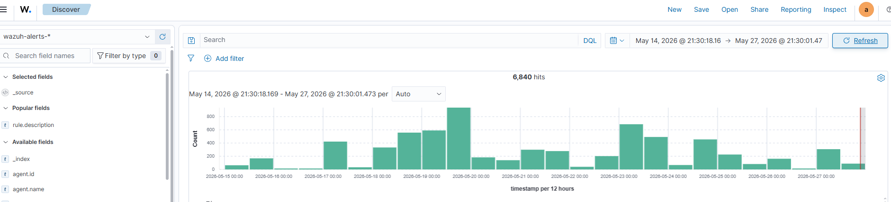
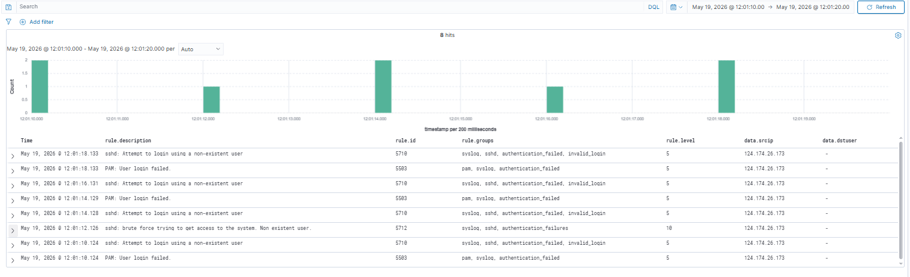
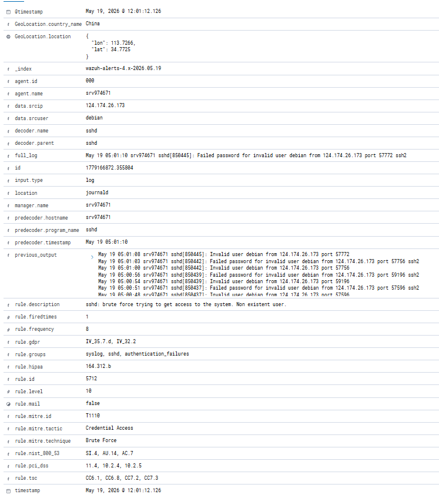
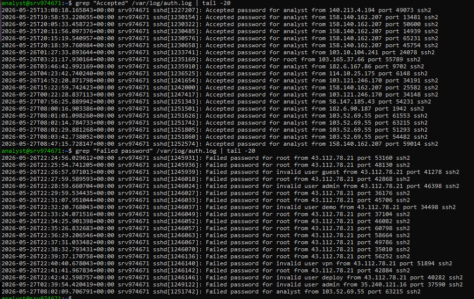
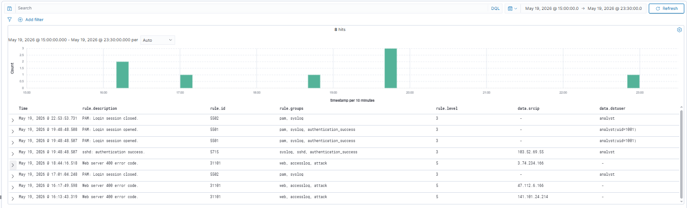
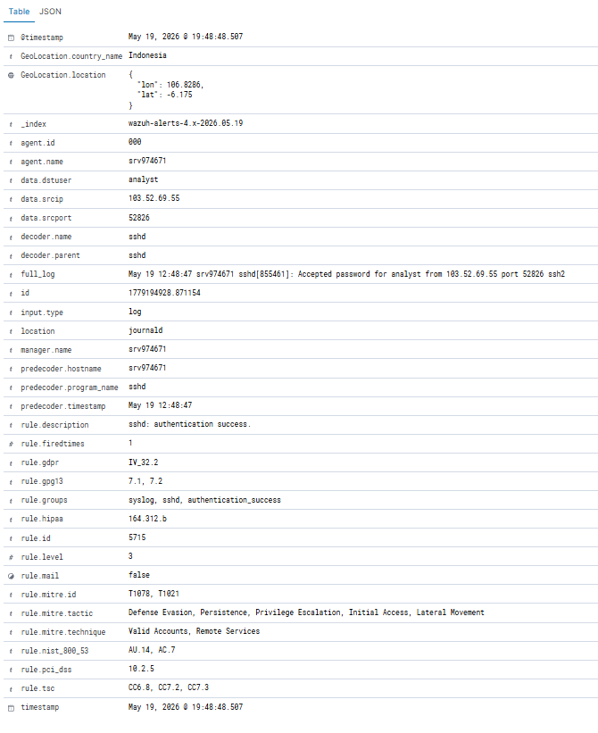
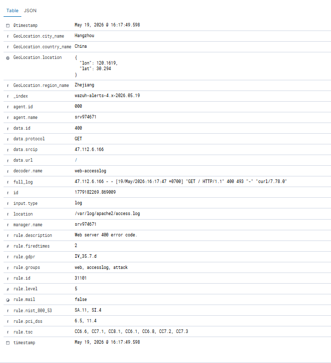
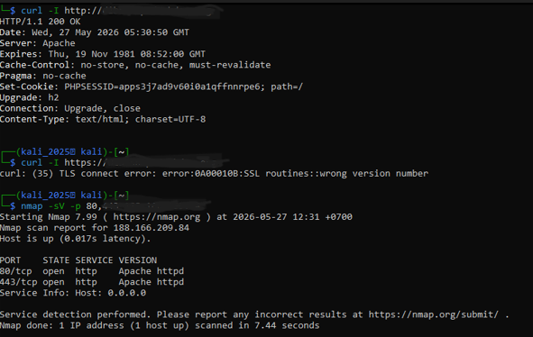

# Digital Forensics & Incident Response: SIEM-Based Post-Breach Investigation

# Objective:
* Incident Reconstruction: Conduct a comprehensive security log investigation on the compromised e-commerce environment to trace and map the attacker’s malicious timeline
* Root Cause Identification: Analyze system configurations and multi-vector anomalies to discover the primary entry points and security flaws exploited by the threat actor.
* Incident Lifecycle Management: Execute structured containment, eradication, and system recovery procedures following the authoritative NIST SP 800-61 r2 framework.
* Risk Mitigation & Remediation Matrix: Provide a prioritized, actionable technical roadmap to harden host access controls and prevent future persistent breaches.

# Investigation Phases
## Phase 1: Detection & Log Correlation
* SIEM Alert Triage: Monitored and triaged historical SIEM logs spanning a 14-day window, isolating a massive spike of 6,840 critical validation events.
* Cross-Log Correlation: Linked distinct alert signals across syslog, sshd, and web/apache rule groups to establish a unified cross-log trail.
* Tactic Identification: Confirmed a highly calculated "Low and Slow" adversary pattern designed to operate strictly below rule level 15 to evade automated alerts.

*Figure 1: Multi-vector security alert telemetry within the co-located Wazuh SIEM dashboard. The upper visualization captures the macro-level authentication spike patterns over a 14-day observation window, while the lower panel correlates time-sliced micro logs pinpointing targeted server probing attempts.*

## Phase 2: Technical Investigation & Path Analysis
* Initial Attack Mapping: Identified external IP 124.174.26.173 executing a persistent, automated dictionary-based brute force campaign against Port 22 SSH.
* Attack Surface Shifting: Tracked the adversary's lateral shift to application layers, detecting malicious automated web directory scans from IP 47.112.6.166 that triggered heavy HTTP 400 anomalies.
* Breach Point Verification: Pinpointed the exact moment of privilege compromise at 19:48:48 WIB via a rogue single successful authentication event (Rule ID 5715) from IP 103.52.69.55.
  
<!-- POSISI GAMBAR 2 -->

*Figure 2: Comprehensive SIEM alert breakdown mapping a high-frequency SSH brute force campaign. The telemetry logs explicit authentication failures against non-existent accounts (Invalid user debian) targeting Port 22, officially tagged under MITRE ATT&CK T1110 (Credential Access) originating from a threat node in China.*

*Figure 3: Command-line audit of `/var/log/auth.log` isolating the definitive point of breach. The lower panel tracks high-frequency authentication failures from adversarial infrastructure, while the upper panel exposes the critical transition where IP 103.52.69.55 successfully bypasses controls to gain unauthorized remote shell access via compromised local credentials.*

*Figure 4: SIEM event correlation telemetry capturing multi-vector threat activities. The timeline integrates automated application-layer web scanning anomalies (Web server 400 error codes under Rule ID 31101) alongside concurrent successful host-level authentications (sshd: authentication success under Rule ID 5715).*

<!-- POSISI GAMBAR RELEVAN -->

*Figure 5: Critical post-breach SIEM alert breakdown exposing the definitive account takeover event. The telemetry documents a high-severity successful authentication (Rule ID 5715 - sshd: authentication success) via a compromised local profile (analyst) mapped directly to MITRE ATT&CK T1078 (Valid Accounts) utilizing a localized Indonesian network node.*

<!-- POSISI GAMBAR 6 -->

*Figure 6: In-depth SIEM log analysis isolating application-layer reconnaissance footprint. The alert captures automated web probing anomalies on `/var/log/apache2/access.log` using a standard `curl` user-agent, officially flagged under Rule ID 31101 and geolocated back to a malicious scanning infrastructure in Hangzhou, China.*

## Phase 3: Containment, Eradication & Hardening
* Active Threat Containment: Enforced instant connection termination on active sessions bound to the compromised user and dropped adversary IPs using perimeter firewalls.
* Environment Eradication: Audited core administrative configurations (/etc/passwd and .ssh/authorized_keys) to verify backdoor absence and enforced a global credential rotation.
* System Hardening Matrix: Engineered a comprehensive risk matrix to eliminate entry points, migrating to key-based SSH authentication, deploying Fail2ban, and integrating a ModSecurity WAF.

*Figure 7: Perimeter attack surface profiling using Nmap service detection and dynamic cURL header inspection. The analytics expose a critical infrastructure misconfiguration where Port 443 is operational under unencrypted HTTP architecture instead of standard SSL/TLS, alongside complete absence of defensive HTTP security headers.*

<!-- POSISI GAMBAR RELEVAN -->

*Figure 8: Live forensics triage executing temporary file system auditing via time-based query (`-mtime -1`). This process maps active system artifacts and modified telemetry targets altered within a 24-hour window, establishing a baseline to verify environment eradication and ensure no malicious persistence mechanisms or backdoors were deployed.*

## Phase 4: Remediation & Security Recommendations
* Immediate Access Hardening: Recommended changing global SSH configurations to disable password-based logins (PasswordAuthentication no) and enforcing strict cryptographic public-key authentication.
* Automated Network Guarding: Advised the deployment and configuration of the Fail2ban module to dynamically detect and auto-block rogue external IPs exceeding threshold authentication failures.
* Application Perimeter Defense: Proposed the integration of an open-source Web Application Firewall (ModSecurity) alongside updated SSL/TLS certificates and security headers (HSTS, CSP) to suppress malicious directory parsing.

## Summary of Digital Forensics Accomplishments
The investigation successfully mapped and analyzed a sophisticated infrastructure breach, categorized with a Medium Risk Score (5.9/10) on external layers but reaching high local exploitation risks.
The following key milestones were achieved:
* Telemetry Cross-Log Validation: Confirmed an active, persistent multi-vector assault by correlating 6,840+ structured alerts across separate local interface nodes
* Reconnaissance Pattern Mapping: Successfully identified a calculated "Low and Slow" evasion campaign explicitly designed to bypass high-level automated SIEM thresholds
* Root Cause Diagnostics: Documented a critical failure in internal perimeter filtering, specifically pinpointing exposed administrative ports left fully open to the public web.
* Breach Point Isolation: Successfully verified the exact timestamp and external actor IP behind the fatal credential leak that led to official account takeovers.
* Standardized Threat Modeling: Aligned all discovered adversary activities and operational tactics directly with the MITRE ATT&CK Enterprise Matrix framework.
* Defensive Hardening Roadmap: Formulated a prioritized remediation matrix dividing instant perimeter containment from layered application defensive upgrades.

## Conclusion
Through this deep-dive analysis, the complex post-breach environment of the e-commerce infrastructure has been systematically unmasked. The investigation began with extensive log aggregation and evolved into a full-scale incident response breakdown—starting from isolating raw log telemetry to executing strategic network containment. Every step of this process was aimed at eliminating monitoring blind spots and structural misconfigurations within the production server. By mapping the adversary’s footprint to industry-standard security frameworks, I have transformed raw analytical logs into a resilient, proactive mitigation blueprint. This journey proves that even when telemetry systems encounter resource strains, a structured and methodical forensic investigation can successfully track, isolate, and neutralize active infrastructure threats before they scale into irreversible data exfiltration.

**Technologies Used**: Wazuh SIEM, Linux CLI Analytics, NIST SP 800-61 r2, MITRE ATT&CK Mapping, Log Correlation, Cross-Log Analysis, CVSS v3.1 Scoring, System Hardening.
