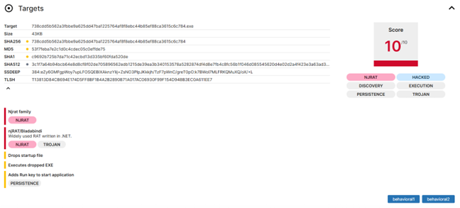

# Malware Analysis & Threat Intelligence: njRAT Investigation

# Objective:

* Malware Analysis in Sandbox Environments: Demonstrate the ability to safely investigate suspicious files using automated sandbox tools (Triage) without compromising host systems.
* Indicator of Compromise (IoC) Identification: Extract critical forensic data such as SHA-256/MD5 hashes, Command & Control (C2) IP addresses, and malicious registry keys.
* Static & Dynamic Analysis Implementation: Proficiency in examining file metadata (Static) and monitoring real-time process activity, system modifications, and network communications (Dynamic).
* MITRE ATT&CK Framework Mapping: Categorize adversary tactics and techniques, including Persistence, Defense Evasion, and Discovery, to standardize threat intelligence.
* Risk Assessment & Mitigation Strategy: Provide critical risk scoring (10/10) and actionable remediation steps to neutralize the threat and prevent future infections.
  
# Investigation Phases
## Phase 1: Identification & Fingerprinting

File Identity Information:
* File Name: 738cdd5b562a3fbbe9a625dd47ba1225764af8f8ebc44b85ef88ca3615c6c784.ZIP
* Format: Password-protected compressed file (.ZIP)
* Size: 17 KB
* Access Method: Grey Box (the analyst was provided access to extract the ZIP file)

Digital Fingerprints (Hashes):

These digital fingerprints serve as a unique identity to ensure file integrity and for identification against global malware databases:
* SHA-256: 27e718684ff0f3e57de11f27ce854ce0227858cca44fc7746cd4fc15c2de76b
* MD5: 31ee9eec2e14d2034e60b97295c581bd
* SHA-1: d848a75494752653e375f735e5e94fed3c7e246e

## Phase 2: Static Analysis

Goal: Analyze file characteristics without execution.
Action: Detected an Unsigned PE (Portable Executable) file. Initial signatures pointed to the njRAT (Bladabindi) family, specifically the "0.7 Golden Edition" by Hassan Amiri.
Phase 3: Dynamic & Behavioral Analysis
Goal: Observe the malware's behavior in a controlled, isolated environment.
Action:
Persistence: Monitored the creation of Registry Run Keys and Scheduled Tasks to ensure the malware survives system reboots.
Masquerading: Observed the malware dropping files using fake icons (VLC, PDF, Word) to trick users.
Process Injection: Analyzed how the payload hides within legitimate system processes.
Phase 4: Configuration Extraction & C2 Tracking
Goal: Identify the attacker's infrastructure.
Action: Extracted the Command & Control (C2) configuration:
C2 Server: 213.209.150.210
Port: 7773
Botnet Campaign: HacKed
Phase 5: MITRE ATT&CK Mapping & Mitigation
Goal: Standardize findings and provide a defense roadmap.
Action: Mapped activities to MITRE ATT&CK (e.g., T1547.001 - Boot or Logon Autostart Execution). Issued a Critical Risk Score (10/10) and recommended registry cleaning, C2 IP blocking, and antivirus signature updates.
