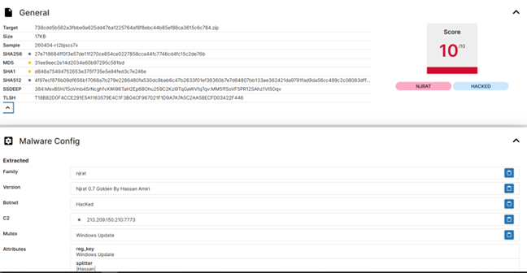
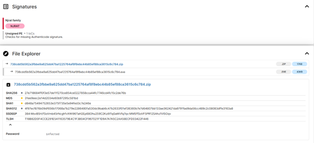
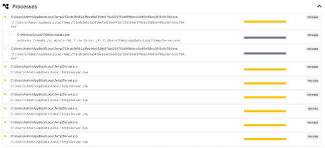
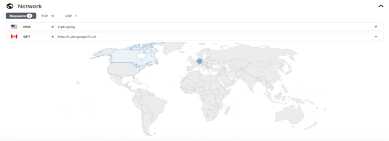
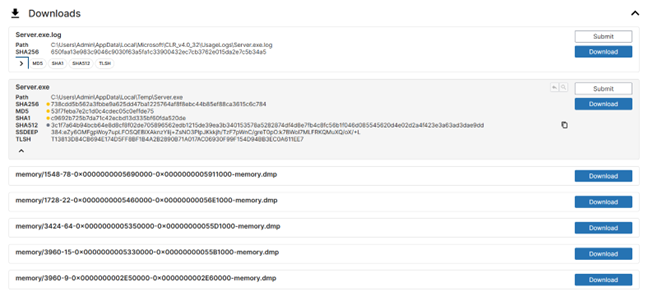
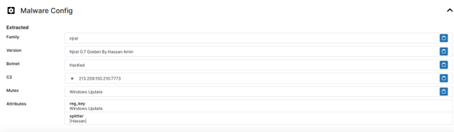
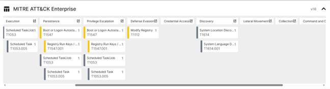

# Malware Analysis & Threat Intelligence: njRAT Investigation

# Objective:

* Malware Analysis in Sandbox Environments: Demonstrate the ability to safely investigate suspicious files using automated sandbox tools (Triage) without compromising host systems.
* Indicator of Compromise (IoC) Identification: Extract critical forensic data such as SHA-256/MD5 hashes, Command & Control (C2) IP addresses, and malicious registry keys.
* Static & Dynamic Analysis Implementation: Proficiency in examining file metadata (Static) and monitoring real-time process activity, system modifications, and network communications (Dynamic).
* MITRE ATT&CK Framework Mapping: Categorize adversary tactics and techniques, including Persistence, Defense Evasion, and Discovery, to standardize threat intelligence.
* Risk Assessment & Mitigation Strategy: Provide critical risk scoring (10/10) and actionable remediation steps to neutralize the threat and prevent future infections.
  
# Investigation Phases
## Phase 1: Identification & Fingerprinting

File Identity Information:
* File Name: 738cdd5b562a3fbbe9a625dd47ba1225764af8f8ebc44b85ef88ca3615c6c784.ZIP
* Format: Password-protected compressed file (.ZIP)
* Size: 17 KB
* Access Method: Grey Box (the analyst was provided access to extract the ZIP file)

Digital Fingerprints (Hashes):

These digital fingerprints serve as a unique identity to ensure file integrity and for identification against global malware databases:
* SHA-256: 27e718684ff0f3e57de11f27ce854ce0227858cca44fc7746cd4fc15c2de76b
* MD5: 31ee9eec2e14d2034e60b97295c581bd
* SHA-1: d848a75494752653e375f735e5e94fed3c7e246e

## Phase 2: Static Analysis

Key Findings:
* Malware Classification: Identified as the njRAT (Bladabindi) family, categorized as a Remote Access Trojan (RAT).
* Version: njRAT 0.7 Golden (Hassan Amiri Edition).
* Security Status: Labeled as Malicious with a critical score of 10/10.
* File Signature: Detected as an Unsigned PE (Portable Executable), meaning it lacks an official certificate or vendor label, which is highly suspicious.
* Evasion Technique: The malware was delivered inside a password-protected ZIP file to bypass antivirus filters.
* Configuration Extraction (C2):
  * C2 Server IP: 213.209.150.210
  * Port: 7773 (pp. 7, 11)
  * Botnet Campaign Name: HacKed
* Persistence Characteristics: The code includes instructions to insert itself into the Windows Registry using the masqueraded name "Windows Update".
  
## Phase 3: Dynamic & Behavioral Analysis

* Key Findings & Observed Activities:
  * Persistence (Taktik Bertahan):
    * Registry Run Keys: Malware automatically adds a "Run" key to HKEY_CURRENT_USER\Software\Microsoft\Windows\CurrentVersion\Run.
    * Scheduled Tasks: Utilizes schtasks.exe (T1053.005) to schedule recurring executions, ensuring it remains active even after a system reboot.
    * Masquerading Name: Uses the fake name "Windows Update" in the registry to blend in with legitimate system processes.
  * Masquerading & File Dropping (Penyamaran):
    * Fake Icons: Observed "Dropping Files" mass-scale onto the Desktop using icons of popular applications like VLC, Word, and PDF to trick users into clicking them.
    * Extension Spoofing: These files appear to be documents but actually have a hidden .exe extension.
  * Process Injection & Host-Based Behavior:
      * Process Activity: Analyzed how the payload executes and hides behind legitimate system processes.
      * Defense Evasion: Modifies system security configurations to hide its presence from the user and antivirus software.
  * Discovery (Pengintaian):
      * Collected sensitive information about the victim's environment, including System Location and System Language, to adapt its malicious behavior.

## Phase 4: Configuration Extraction & C2 Tracking

Extracted Configuration Details:
* C2 Server (Command & Control): 213.209.150.210
* Port: 7773
* Malware Version: njRAT 0.7 Golden (Hassan Amiri Edition)
* Botnet Campaign Name: HacKed
* Mutex Identity: Windows Update (used for masquerading/hiding in the system)
* Character Splitter: Hassan

Network Behavior Observations:
* Connection Type: Established bidirectional TCP connections (12 connections observed) to the C2 server for remote control
* Data Exchange: The malware sends victim system information to the attacker and waits for incoming instructions (Remote Access Trojan behavior)
* DNS Resolution: Used UDP (8.8.8.8) for domain name resolution during its activity

## Phase 5: MITRE ATT&CK Mapping & Mitigation

MITRE ATT&CK Mapping
* Persistence & Privilege Escalation (T1547.001): Boot or Logon Autostart Execution via Registry Run Keys.
* Execution (T1053.005): Scheduled Task/Job to ensure the malware runs periodically.
* Defense Evasion (T1112): Modify Registry to hide traces and change security configurations.
* Discovery (T1614 & T1614.001): System Location and System Language Discovery to gather environment metadata.

Recommended Mitigation (Defense Roadmap)
* Registry Cleaning: Immediately inspect and delete suspicious entries in HKEY_CURRENT_USER\Software\Microsoft\Windows\CurrentVersion\Run, specifically looking for fake names like "Windows Update".
* File Deletion: Search for and remove .exe files in %AppData% or %Temp% folders, especially those disguised with VLC, Word, or PDF icons.
* Network Blocking (C2 Block): Block the attacker’s IP address 213.209.150.210 and Port 7773 on the enterprise firewall or proxy.
* Security Education: Train users not to open password-protected .ZIP files from unknown sources, as this is a common tactic to bypass email filters.
* Antivirus Updates: Ensure signatures (e.g., Windows Defender) are up-to-date. Since njRAT is a known legacy variant, it should be easily detected by updated software.

## Summary of Malware Analysis Accomplishments
The investigation successfully identified and analyzed a high-risk security threat, categorized with a Critical Risk Score (10/10). The following key milestones were achieved:
* Positive Identification: Confirmed the suspicious sample as a Remote Access Trojan (RAT) from the njRAT (Bladabindi) family, specifically the 0.7 Golden Edition by Hassan Amiri
* Comprehensive Fingerprinting: Established a unique digital identity for the malware using SHA-256, MD5, and SHA-1 hashing algorithms for global threat database cross-referencing
* C2 Infrastructure Extraction: Successfully unmasked the attacker's Command & Control (C2) infrastructure, identifying the IP Address (213.209.150.210), Port (7773), and the campaign name "HacKed"
* Behavioral Mapping: Documented the malware's survival tactics, including Persistence via Registry Run Keys, Execution through Scheduled Tasks, and Masquerading techniques using fake VLC/PDF/Word icons to deceive users
* Standardized Threat Modeling: Aligned all observed malicious activities with the MITRE ATT&CK Framework, specifically targeting tactics such as Defense Evasion (T1112) and Discovery (T1614)
* Defensive Roadmap: Formulated a multi-layered mitigation strategy involving Registry cleaning, C2 IP blocking, and signature-based detection to prevent data breaches and unauthorized system access

## Conclusion
The analysis confirms this file is a highly dangerous Remote Access Trojan (RAT) from the njRAT (Bladabindi) family. It grants the attacker full control over the victim's device, including keylogging, webcam access, and the ability to deploy additional malware like Ransomware.
