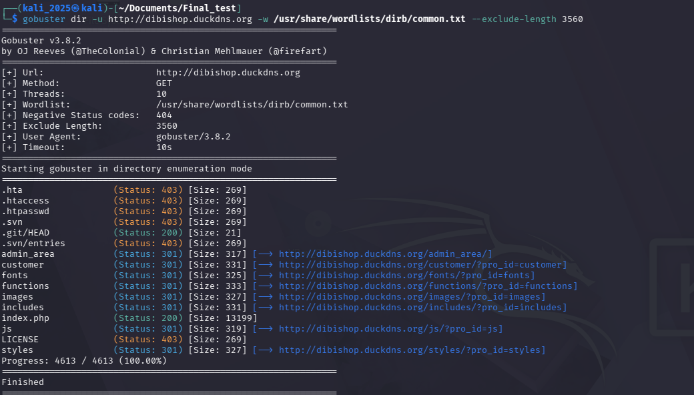
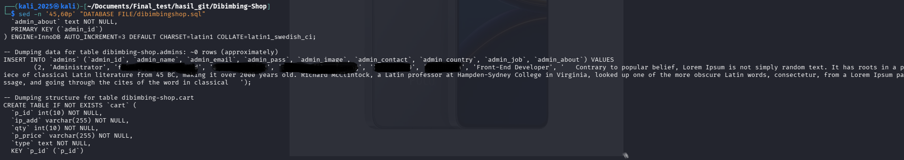
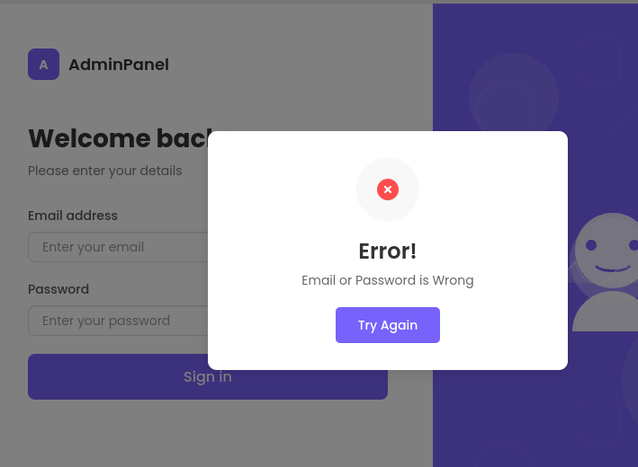

# Penetration Testing & Findings Report: DibiShop E-Commerce Investigation

# Objective:
* Security Evaluation in Pre-Live Environments: Conduct a comprehensive security assessment on the DibiShop e-commerce application to identify vulnerabilities before the Go-Live phase.
* Identification of Critical Attack Chains: Analyze how multiple low or medium-level misconfigurations can be chained together to achieve full administrative takeover.
* Information & Sensitive Data Leakage Analysis: Investigate public-facing infrastructure for exposed sensitive files, such as Git directories and database backups.
* Access Control & Authentication Hardening: Test the strength of authentication mechanisms and identify potential bypasses in administrative panels.
* Risk Mitigation & Remediation Strategy: Provide actionable, risk-based recommendations to strengthen the application's security posture and prevent data breaches.

# Investigation Phases
## Phase 1: Reconnaissance & Fingerprinting

* Infrastructure Mapping: Identified the target environment running on Apache Web Server and PHP framework.
* Attack Surface Discovery: Utilized Gobuster for directory enumeration, successfully uncovering hidden and sensitive directories.
* Asset Identification: Confirmed critical exposure of the /.git/ directory (Status 200 OK) and identified the administrative entry point at /admin_area/.
  
## Phase 2: Vulnerability Analysis & Exploitation

* Source Code Exfiltration: Executed Git-Dumper to reconstruct the entire application source code from the exposed metadata, allowing for a thorough offline static analysis.
* Secret Discovery: Discovered a legacy database backup file (dibimbingshop.sql) within the public-facing repository structure.
* Cryptographic Assessment: Verified that the application suffered from CWE-256 (Insecure Password Storage), as administrative passwords were found in plaintext format baris 50 of the SQL dump.
  
## Phase 3: Post-Exploitation & Impact Assessment

* Privilege Escalation: Successfully performed a Full Administrative Takeover by authenticating into the /admin_area/login.php using the exfiltrated plaintext credentials.
* Data Compromise Validation: Demonstrated the ability to manipulate real-time financial transactions, modify product catalogs, and access mass Personally Identifiable Information (PII) of customers.
* Attack Chain Confirmation: Validated that the misconfiguration chain—from metadata exposure to credential leakage—results in a Total System Compromise.

## Phase 4: Remediation & Security Recommendations
* Immediate Hardening: Recommended blocking public access to dotfiles and internal directories (/includes, /functions) via Web Server configuration (.htaccess or Nginx block rules).
* Credential Security: Advised immediate migration to BCrypt/Argon2 hashing algorithms for all stored passwords and a mandatory global credential rotation.
* SDLC Integration: Proposed the implementation of SAST/DAST tools within the CI/CD pipeline to automatically detect hardcoded secrets and misconfigurations before production deployment.

## Summary of Penetration Testing Accomplishments
The investigation successfully identified and analyzed a high-risk security threat, categorized with a Critical Risk Score (9.8/10). The following key milestones were achieved:
* Positive Identification: Confirmed a critical security misconfiguration where the .git directory was publicly accessible, leading to full source code disclosure.
* Sensitive Data Extraction: Successfully unmasked a publicly exposed database backup file containing administrative credentials.
* Cryptographic Analysis: Documented a major failure in secrets management, specifically identifying that administrative passwords were stored in Plaintext without hashing algorithms.
* Attack Chain Validation: Successfully performed a Full Administrative Takeover by leveraging leaked credentials to bypass authentication panels.
* Standardized Threat Modeling: Aligned all observed vulnerabilities with the OWASP Top 10 Framework.
* Defensive Roadmap: Formulated a multi-layered mitigation strategy to prevent future data breaches and unauthorized system access.
  
## Conclusion
Through this deep-dive analysis, the intricate attack chain of the DibiShop application has been systematically unmasked. The investigation began with simple reconnaissance and evolved into a full-scale forensic breakdown—starting from fingerprinting exposed metadata to tracing leaked administrative credentials. Every step of this process was aimed at eliminating the 'blind spots' within the production infrastructure. By mapping the application's weaknesses to industry-standard frameworks, I have transformed raw technical findings into a proactive defense roadmap. This journey proves that even when a system appears functional, a structured and methodical analysis can successfully track, isolate, and neutralize critical vulnerabilities before they lead to a catastrophic data breach.
